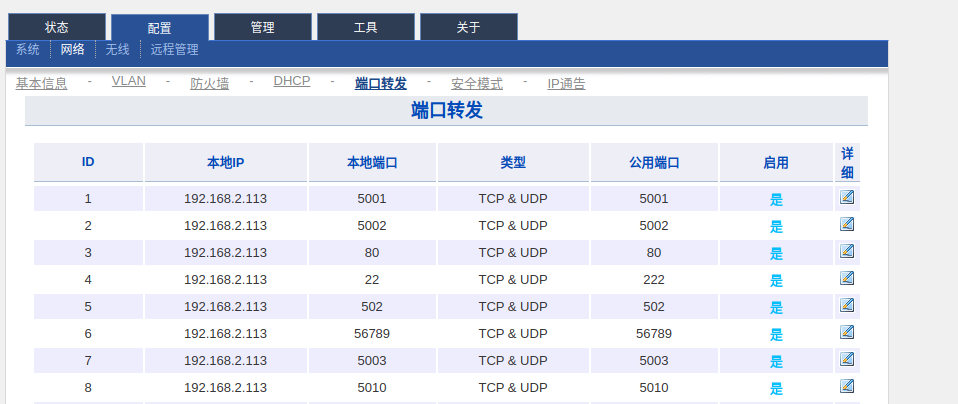
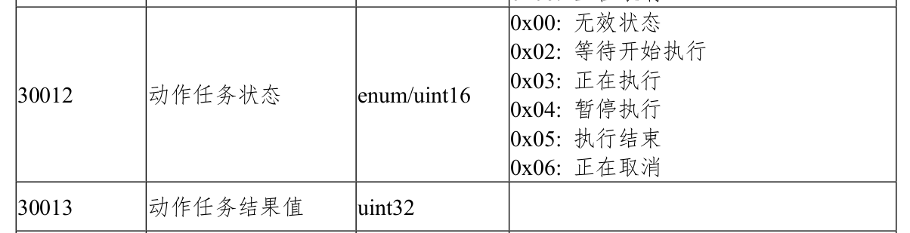
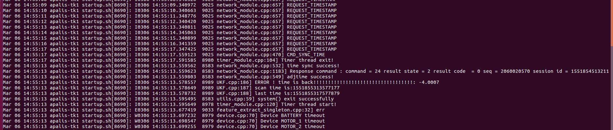
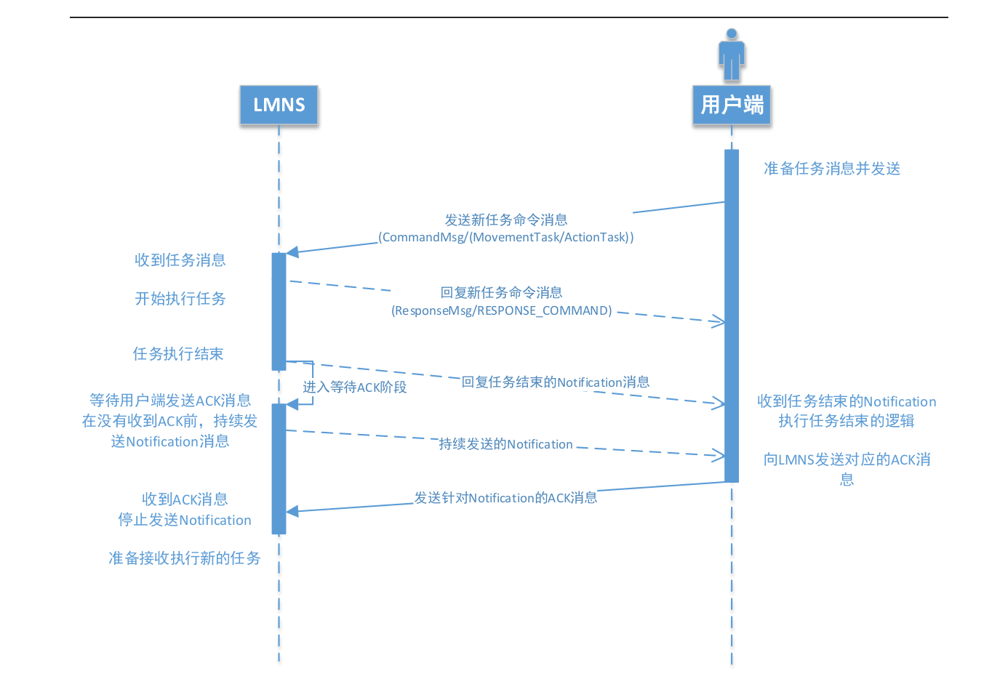

# FAQ for SROS
## 项目相关

### ssh远程登录AGV时，报“Permission Denied”（密码错误）

原因：当使用节点通的网关模式时，22端口被节点通占用，此时实际是连接到了节点通

解决方法：

在节点通中配置端口转发，将内部的22端口转发到2222端口，然后使用 `ssh root@IP -p 2222` 指定端口进行登录


### ssh远程登录AGV时，报“Connection closed by remote host”

原因：sshd的`usePAM`参数设置为了yes，导致无法用root用户登录

解决方法：

修改`/etc/ssh/sshd_config`中 `usePAM` 为 no


### ssh远程登录AGV时，报“Connection refused”

现象：192.168.71.5能ping通，但ssh链接报上面的错误。192.168.71.230用ssh能登上去，但是登录chip-web很久都加载不出来。

原因：应该是MassifAp1出了问题。

解决办法：重启MassifAP1路由器。


 
### 部分SRC无法单独升级SRC的问题
#### 情况1
现象：升级后一直不主动重启，手动重启后再去查看src的版本号依旧没变

原因：SRC版本号低于4.1.0的都不支持在线升级功能

解决方法：需要通过下载器手动刷一次带在线升级功能的SRC，可以找杨佳帮忙

#### 情况2
现象： 都没有进度条直接提示失败

原因： HTTP服务器端口号不是80

解决办法： 将"network.http_service_port"设置为80


### 改用用http传输文件前的chip，且用节点通做数据转发网管的AGV，无法加载地图

现象：chip加载进度停留在1%

原因： 因为文件传输用的端口号为56789，而节点通没有转发此端口号，所以导致无法传输地图文件。

解决办法：用新的http传输文件的chip。


### AGV无法导航到站点，chip中系统状态显示：无法抵达目标位置

原因： 可能是一些配置项没有开启

- nav.enable_net_nav(418): 启用路网导航
- nav.enable_free_nav(417): 启动自由导航
- nav.enable_free_nav_when_net_no_way(429): 在路网导航失败的情况下启动自由导航


解决办法：将上述三个配置都开启


### 用户反馈：AGV到达站点后总是转动
原因：客户用modbus-TCP和我们通信，他们为了方便，一直向移动到站点的寄存器写他们想要移动到的站点。当移动任务结束后，
依旧会继续向寄存器中写要到达的站点，若到达的站点有偏差，agv会再次启动移动到站点的任务，
这时候AVG会就会出现客户所说的转动的情况。

解决办法：引导客户用正确的方式使用我们的modbus协议，即需要移动到站点的时候就写一次寄存器，而不是一直写寄存器。


### AGV启动后手动控制、移动任务都无法执行，没有解抱闸，没有急停，但是硬件状态中显示电机有问题

原因：可能是开机前抱闸开关已经被按下了，VSC_v3.8以前的版本开机前不会去检查抱闸开关是否被按下了。所有上电后，
实际上是解抱闸的状态，但是sros得到的状态是没有解抱闸。

解决办法：
1. 解除抱闸开关，断电重启。
2. 将VSC升级到v3.8以后的版本。


### 导入参数后出现各种奇怪的问题
现象：
1. 移动按照路径走的时候偏差很大
2. 导航偏差很大，但是chip还是现实定位成功
3. agv连不上
4. ...

原因：导入其他车的配置，会将其他车的参数都会导入进去。

解决办法：不建议导入其他车的配置，只建议导入车以前的配置。


### modbus-TCP连接失败
可能原因：
1. sros版本号需要大于等于v4.3.2.（一定要通过版本号来判断是否支持modbus，出现过一次，
版本号为v4.3.0但是配置中已经有modbus-TCP的配置了的情况，应该是版本被回退过。）
2. modubs.eneable_modbus_tcp(2101)配置没有开启。（开启后需要重启）
3. AGV上的路由器使用了网关模式，且没有转发502端口号。


### 节点通端口转发需要配置转发的端口
#### 节点通自身Web配置：
配置 -> 系统 -> Web配置

HTTP端口：8090
HTTPS端口：443

#### 端口转发：
配置 -> 网络 -> 端口转发

| 本地端口 | 公用端口 | 备注 |
| ------ | ------ | ------ |
| 5001 | 5001 | protobuf通性的端口号 |
| 5002 | 5002 | websocket通信端口号 |
| 5003 | 5003 | 华为测试线的通信端口号 |
| 5010 | 5010 | 实现通过udp 5010端口获取节点通client的NAT外网IP地址功能 |
| 80   | 80   | HTTP通信端口号 |
| 22   | 2222 | ssh的通信端口号 |
| 502  | 502  | modbus通信端口号 |
| 56789| 56789| 文件传输通信端口号 |
| 8005 | 8005 | udp广播端口号 |

NOTE：
1. 修改端口转发后需要点击右上角保存并重启按钮
2. 若用了节点通的路由器，出现网络问题，优先检测是否是节点通端口转发没有配置 



### 无法登录Matrix
可能原因:
1. 检查是否开了代理，代理后不能访问到当前局域网。
2. 网页登录的端口号和network.http_service_port配置的端口号不一致。


### 系统参数中的配置缺少某个参数
原因：部分参数需要更高的权限才能显示出来

解决办法：用更高权限的用户登录


### 如何从modbus获取动作执行状态



### pgv矫正无法结束
要将src.continuous_mode(651)设置为7，具体详情找杨佳


### modbus poll 软件寄存器格式与modbus中格式对照
| modbus中寄存器格式 | modbus poll中寄存器格式 | 备注 |
| ------ | ------ | ------ |
| int | 32 Bit signed -> Big-endian |  |
| uint | 32 Bit Unsigned -> Big-endian |  |


---


### 主动上传ip需要设置那些参数
- network.enable_udp_upload_ip_info ： True
- network.ip_info_upload_freq ： 上传间隔时间
- network.server_ip ： 服务器ip
- network.server_port ： 服务端口号


---


### modbus-rtu读取数据一直超时
现象：
日志中一直显示读取数据位空
```log
I0507 11:38:14.780627  2873 modbus_module.cpp:220] ModbusModule: 读取数据为空！ Connection timed out
I0507 11:38:15.458837  2873 modbus_module.cpp:220] ModbusModule: 读取数据为空！ Connection timed out
I0507 11:38:15.970432  2873 modbus_module.cpp:220] ModbusModule: 读取数据为空！ Connection timed out
```

可能原因：
没有设置slave id

解决办法： 
将slave id 设置为17


---


### 用户使用modbus-tcp偶发报错：Response was not of expected transacation ID, Expected 95, received 93. 
现象：
- 客户用的是第三方库
- 现象是偶发的

原因：
modbus是一问一答的协议，而用户用的时候，一次发送两个请求，所以导致了，最后一个发送的，和最新一个接受的ID对不上

解决办法： 
指导用户发送一个请求等待完回复后再发送第二个请求。


---


### 用户那边执行顶升旋转一直不结束
可能原因：
顶升旋转需要移动，这样和移动任务是冲突的。用户同时发送了移动任务和顶升旋转任务，所以导致了顶升旋转任务一直不结束

解决办法： 
- src会添加限制，若不能同时执行的动作，下发后报执行出错
- 指导用户不要同时发送移动任务和顶升旋转任务


---


### sros在执行移动任务时，若此时重启sros会怎样？
- agv继续向前走一小段，然后触发急停。
- 对于老的电机驱动器，agv会一直以继续当前运动状态。


---


### 如何判断agv是否在充电
- chip右下角会显示一个充电电池的图标
- chip-web右上角会有一个充电电池的图标
- 硬件状态中电池状态会显示：“充电中”
- agv触摸屏右下角会有充电电池图标
- 充电桩的三色灯会显示绿色
- 充电桩的小屏幕会显示当前正在充电


---


### 如何让agv自动充电
- 当agv和充电桩对准后，发送“启动自动充电命令”即可
- 将main.charge_station_no(908)设置对应的充电站点，当agv到达充电站点后会自动启动充电
- 当agv和充电桩对准后，发送动作任务“开始充电”（78,1,0）即可


---


### 手动更新数据的config表
```shell
/sros/db » python db_upgrade_config_table.py main.db3 db_config.csv                                                                                                                               john@john-pc
Namespace(csv_file_path='db_config.csv', db_file_path='main.db3')
完成更新config表！
```


### 导入配置文件失败的情况
- 新版本sros的配置往老版本sros导配置，可能会出现导入失败的情况，应为有些参数老版本不存在


---


### 区域避障侧边减速距离不生效
- v4.6.x存在这个问题，v4.7.0正式版之后的才修复了这个问题


---


### 区域避障侧边减速距离只有一瞬间有效
- 区域避障侧边减速距离和避障停止距离是绑定的，所以当避障停止距离设置的很小就会出现这样的现象


---


### 从站点1移动到站点2，但是规划的路径名没有到站点2，而是停在另一个节点上
现象：
- 站点1在节点1上，站点2在节点2上，站点1和站点2中间有一个节点3，从站点1到站点2的路径规划停在了节点3上。

原因：
- 有一条从节点1到节点3的路径1，路径显示的时候是用坐标。但是路径1的结束节点是2，导航时用的是节点。
这样在寻路的时候，通过路径1，就直接找到了从节点1到达节点2的路径，但是实际上路径1到达的坐标是节点3的坐标。

解决办法：
- 删除掉路径1，重新画一条
- 升级chip，chip存在这样的问题。
- 后期sros可能会加限制


---


### 导出日志能导出多久前的日志？
- 正常导出日志能导出sros当前时间前10天的日志，大于10天的日志将会被清除。
- 当磁盘占用达到90%以后，sros启动后会清除大于1天的日志，所以导出的日志只有当前sros当前时间前一天的日志。
- 当时间出现回流时，大于sros当前时间的将不会被清除点，但也无法导出。


---


## 开发相关

### 交叉编译报错：error: crtbeginS.o: No such file or directory
交叉编译时报错：
```shell
arm-angstrom-linux-gnueabi-g++: error: crtbeginS.o: No such file or directory
arm-angstrom-linux-gnueabi-g++: error: crtendS.o: No such file or directory
```

解决方法：
```shell
 cp /data/toradex/sdk/sysroots/armv7at2hf-vfp-neon-angstrom-linux-gnueabi/usr/lib/arm-angstrom-linux/5.2.1/* /data/toradex/sdk/sysroots/armv7at2hf-vfp-neon-angstrom-linux-gnueabi/usr/lib
```


### 交叉编译报错：没有那个文件或目录: ./arm-angstrom-linux-gnueabi-size
原因：

.sh格式的sdk解压后，不能随意修改sdk路径，否则会报错，如果确实需要更改路径可以通过软链接实现，或者重新解压


### git clone报错：sign_and_send_pubkey: signing failed: agent refused operation

解决方法：
Looks like an ssh-agent is running already but it can not find any keys attached. To solve this add the private key identities to the authentication agent like so:
```shell
ssh-add
```


### 同步时间后日志怎样显示



---


### 使用protobuf于sros通信，什么情况下TCP连接会断开
- 登录后session_id还为0
- 客户端主动断开链接
- 开启了network.enable_tcp_keep_alive配置，然后在指定时间内没有回复服务器数据。
- sros崩溃
- 客户端接收线程阻塞，导致数据包一直发不出去，最后服务器将其主动断开。
- tcp层以下的问题。


---


### 连续发送任务后感觉卡段，要等几秒后才能继续
- 当任务结束后agv会发送Notification，并且等待Notification的ACK，由于agv没有收到ACK，所以AGV会等待几秒再启动下一个任务，这就是为什么会感觉卡顿了
- NOTIFY_MOVE_PATH_SENT没有回复也会导致动作挂起等待



---


### journalctl -f 的内容一直不刷新
可能原因：
将时间调整过大于当前时间并产生了日志，然后时间正常了，但是正常时间产生的日志都在这些异常日志的后面，所以导致最后的日志一直显示是异常时间的，所以感觉一直不更新。

解决版本：
清除一些journalctl的日志
```shell
journalctl --vacuum-files=1
```


---