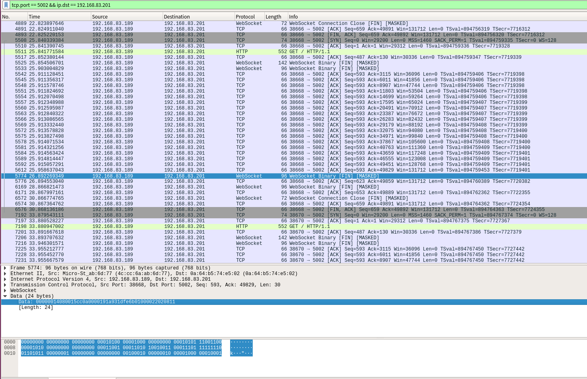

# 奇怪问题记录

## 未修复
### sros 升级包大小异常偏大
现象： 
- 现在正常升级包为7M多（不带chip-web）和8M多（带chip-web），但出现过一次升级包的大小为12.5M，导致升级失败。
- 解压错误提示为：
```shell
>> cat ./SROS-v4.5.0-99c2594-\(\).update | openssl des3 -md md5 -d -k XXX | tar xzvf - -C /

sros/
sros/update/
sros/update/sros_99c2594

gzip: stdin: invalid compressed data--format violated
tar: 归档文件中异常的 EOF
tar: 归档文件中异常的 EOF
tar: Error is not recoverable: exiting now
error writing output file

```
- 升级包的源文件大小正常，但在目标电脑上大小就偏大了，忘记是怎么传输的了，通过微信和邮件尝试下载了一遍，大小又都正常。

#### 尝试过复现路径，但都没有能复现问题。
- 通过微信，从ubuntu传输升级包到Windows的微信
- 微信的文件传输中转等
- 将sros保存到邮件的草稿，然后再次打开草稿，将其发出去。


---


### tk1中/usr/sbin目录下的部分系统命令不能正常执行
*现象：*
- 无法用ssh远程登录

- 版本号： 
```shell
root@apalis-tk1:~# cat /proc/version 
Linux version 3.10.40-2.8.4+gba29b06 (oe-user@oe-host) (gcc version 7.3.0 (GCC) ) #2 SMP PREEMPT Tue Dec 18 03:06:53 UTC 2018
```

- 用串口登录进去执行/usr/sbin目录下的命令大部分会报错
```shell
# tcpdump
-sh:/usr/sbin/tcpdump: cannot execute binary file: Exec format error

# sshd
-sh:/usr/sbin/sshd: cannot execute binary file: Exec format error
```

- 将正常tk1中的/usr/sbin目录下的命令拷贝到有问题的tk1中却能正常执行

- 其他的一切正常


---


### rmmod 命令崩溃，导致startup.sh脚步卡住，从而导致sros一直启动不起来的问题
现象：
- sros崩溃，在重启的时候rmmod时崩溃，然后启动脚本一直卡住，导致sros没有启动
- ssh无法远程登录
- 用串口登录进去，用ps -ef | grep sros 没有看到对应的进程，但用ps -ef | grep ssh 却发现多个sshd进程
- 断电重启后一切正常

关键日志如下：
```shell
>> # journalctl --no-page --since="2019-05-08 2:56" --until='2019-05-08 18:00' | grep -v -E 'Got Break'

May 08 02:57:52 apalis-tk1 startup.sh[240]: E0508 02:57:52.939662   541 socket_can.hpp:143] socket_can: read error -1
May 08 02:57:52 apalis-tk1 startup.sh[240]: W0508 02:57:52.942167   541 socket_can.hpp:164] socket_can: recv loop exit
May 08 02:57:52 apalis-tk1 startup.sh[240]: I0508 02:57:52.942603   541 can_module.cpp:53] runCan loop break, reopen can socket
May 08 02:57:52 apalis-tk1 systemd-udevd[183]: fork of child failed: Resource temporarily unavailable
May 08 02:57:52 apalis-tk1 systemd-udevd[183]: fork of child failed: Resource temporarily unavailable
May 08 02:57:52 apalis-tk1 systemd-udevd[183]: fork of child failed: Resource temporarily unavailable
May 08 02:57:52 apalis-tk1 systemd-udevd[21783]: fork of '/etc/udev/scripts/network.sh' failed: Resource temporarily unavailable
May 08 02:57:53 apalis-tk1 kernel: gpio wake34 for gpio=82
May 08 02:57:53 apalis-tk1 kernel: apalis-tk1-k20 spi1.1: Apalis TK1 K20 MFD driver.
                                   Firmware version 0.11.
May 08 02:57:53 apalis-tk1 kernel: input: apalis-tk1-k20-ts as /devices/platform/spi-tegra114.1/spi_master/spi1/spi1.1/apalis-tk1-k20-ts/input/input30382
May 08 02:57:53 apalis-tk1 kernel: apalis-tk1-k20-can apalis-tk1-k20-can.0: probed 0
May 08 02:57:53 apalis-tk1 kernel: apalis-tk1-k20-can apalis-tk1-k20-can.1: probed 1
May 08 02:57:53 apalis-tk1 kernel: gpiochip_add: registered GPIOs 856 to 1015 on device: generic
May 08 02:57:53 apalis-tk1 startup.sh[240]: terminate called after throwing an instance of 'std::system_error'
May 08 02:57:53 apalis-tk1 startup.sh[240]:   what():  Resource temporarily unavailable
May 08 02:57:53 apalis-tk1 startup.sh[240]: *** Aborted at 1557255473 (unix time) try "date -d @1557255473" if you are using GNU date ***
May 08 02:57:53 apalis-tk1 startup.sh[240]: PC: @ 0xb6a330cc gsignal
May 08 02:57:53 apalis-tk1 startup.sh[240]: *** SIGABRT (@0x214) received by PID 532 (TID 0xb5ea0380) from PID 532; stack trace: ***
May 08 02:57:53 apalis-tk1 startup.sh[240]:     @ 0xb6a342d0 (unknown)
May 08 02:57:53 apalis-tk1 startup.sh[240]:     @ 0xb6a330cc gsignal
May 08 02:57:53 apalis-tk1 startup.sh[240]:     @ 0xb6a34430 abort
May 08 02:57:53 apalis-tk1 startup.sh[240]:     @ 0xb6c53004 __gnu_cxx::__verbose_terminate_handler()
May 08 02:57:53 apalis-tk1 startup.sh[240]:     @ 0xb6c519b0 (unknown)
May 08 02:57:54 apalis-tk1 startup.sh[240]: init can device...
May 08 02:57:54 apalis-tk1 kernel: apalis-tk1-k20 spi1.1: K20 FIFO Bug!
May 08 02:57:54 apalis-tk1 systemd-networkd[23207]: can0: Gained carrier
May 08 02:57:57 apalis-tk1 startup.sh[240]: /sros/bin/startup.sh: line 455:   532 Aborted                 (core dumped) ${SROS_ROOT}/bin/sros --log_path=${SROS_ROOT}/log/
May 08 02:57:57 apalis-tk1 systemd[1]: sros.service: Main process exited, code=exited, status=134/n/a
May 08 02:57:57 apalis-tk1 systemd[22220]: sros.service: Failed at step EXEC spawning /bin/pkill sros: No such file or directory
May 08 02:57:59 apalis-tk1 systemd[1]: sros.service: Control process exited, code=exited status=203
May 08 02:57:59 apalis-tk1 startup.sh[240]: In exit
May 08 02:57:59 apalis-tk1 systemd[1]: sros.service: Unit entered failed state.
May 08 02:57:59 apalis-tk1 systemd[1]: sros.service: Failed with result 'exit-code'.
May 08 02:58:00 apalis-tk1 systemd[1]: sros.service: Service hold-off time over, scheduling restart.
May 08 02:58:00 apalis-tk1 systemd[1]: Stopped SROS Service.
May 08 02:58:00 apalis-tk1 systemd[1]: Started SROS Service.
May 08 02:58:00 apalis-tk1 startup.sh[22264]: Run 'pre_startup_run.sh'...
May 08 02:58:00 apalis-tk1 startup.sh[22264]: pre_startup_run.sh: Nothing.
May 08 02:58:00 apalis-tk1 startup.sh[22264]: SROS startup...
May 08 02:58:00 apalis-tk1 startup.sh[22264]: Check for update...
May 08 02:58:00 apalis-tk1 startup.sh[22264]: net.ipv4.tcp_retries2 = 6
May 08 02:58:00 apalis-tk1 startup.sh[22264]: Cleaning log file before 10 days...
May 08 02:58:00 apalis-tk1 startup.sh[22264]: files be removed:
May 08 02:58:00 apalis-tk1 startup.sh[22264]: /sros/log/sros.apalis-tk1.invalid-user.log.WARNING.20190424-141532.563
May 08 02:58:00 apalis-tk1 startup.sh[22264]: /sros/log/sros.apalis-tk1.invalid-user.log.ERROR.20190426-093337.527
May 08 02:58:00 apalis-tk1 startup.sh[22264]: /sros/log/sros.apalis-tk1.invalid-user.log.ERROR.20190424-141533.563
May 08 02:58:00 apalis-tk1 startup.sh[22264]: /sros/log/sros.apalis-tk1.invalid-user.log.WARNING.20190426-093336.527
May 08 02:58:00 apalis-tk1 startup.sh[22264]: /sros/log/sros.apalis-tk1.invalid-user.log.INFO.20190424-141532.563
May 08 02:58:00 apalis-tk1 startup.sh[22264]: /sros/log/sros.apalis-tk1.invalid-user.log.INFO.20190426-093336.527
May 08 02:58:00 apalis-tk1 startup.sh[22264]: Cleaning old core file...(5)
May 08 02:58:00 apalis-tk1 startup.sh[22264]: files be removed:
May 08 02:58:00 apalis-tk1 startup.sh[22264]: -rw-------    1 root     root     588247040 Apr 19 14:03 /sros/log/core-sros-1555653791.5093
May 08 02:58:00 apalis-tk1 startup.sh[22264]: [update] No update.
May 08 02:58:00 apalis-tk1 startup.sh[22264]: [driver] insmod /sros/driver/ch341.ko
May 08 02:58:00 apalis-tk1 startup.sh[22264]: insmod: ERROR: could not insert module /sros/driver/ch341.ko: File exists
May 08 02:58:00 apalis-tk1 startup.sh[22264]: [driver] insmod /sros/driver/ftdi_sio.ko
May 08 02:58:00 apalis-tk1 startup.sh[22264]: insmod: ERROR: could not insert module /sros/driver/ftdi_sio.ko: File exists
May 08 02:58:00 apalis-tk1 startup.sh[22264]: reload can drivers...
May 08 02:58:00 apalis-tk1 kernel: Unable to handle kernel NULL pointer dereference at virtual address 00000010
May 08 02:58:00 apalis-tk1 kernel: pgd = d446c000
May 08 02:58:01 apalis-tk1 kernel: [00000010] *pgd=95699003, *pmd=ac11e003, *pte=00000000
May 08 02:58:01 apalis-tk1 kernel: Internal error: Oops: 207 [#1] PREEMPT SMP ARM
May 08 02:58:01 apalis-tk1 kernel: Modules linked in: gpio_apalis_tk1_k20 apalis_tk1_k20_ts apalis_tk1_k20_adc apalis_tk1_k20_can(-) apalis_tk1_k20 joydev ftdi_sio ch341 [last unloaded: apalis_tk1_k20]
May 08 02:58:01 apalis-tk1 kernel: CPU: 2 PID: 22298 Comm: rmmod Not tainted 3.10.40-2.7.5+g22e0897 #2
May 08 02:58:01 apalis-tk1 kernel: task: d4c19a40 ti: d414c000 task.ti: d414c000
May 08 02:58:01 apalis-tk1 kernel: PC is at mutex_lock+0x14/0x50
May 08 02:58:01 apalis-tk1 kernel: LR is at drain_workqueue+0x24/0x124
May 08 02:58:01 apalis-tk1 kernel: pc : [<c07288f4>]    lr : [<c0074728>]    psr: 80070013
                                   sp : d414de38  ip : 00000000  fp : bed7ae5c
May 08 02:58:01 apalis-tk1 kernel: r10: c08cb06e  r9 : 00000068  r8 : c0967f10
May 08 02:58:01 apalis-tk1 kernel: r7 : 00000010  r6 : 00000010  r5 : d4889d94  r4 : 00000010
May 08 02:58:01 apalis-tk1 kernel: r3 : 00000000  r2 : 00000001  r1 : 00000000  r0 : 00000010
May 08 02:58:01 apalis-tk1 kernel: Flags: Nzcv  IRQs on  FIQs on  Mode SVC_32  ISA ARM  Segment user
May 08 02:58:01 apalis-tk1 kernel: Control: 30c5387d  Table: 9446c000  DAC: 55555555
May 08 02:58:01 apalis-tk1 kernel: 
                                   PC: 0xc0728874:
May 08 02:58:01 apalis-tk1 kernel: 8874  e1841f93 e3310000 1afffffb f57ff05f e3520001 1affffc3 e99d000c e1a00007
May 08 02:58:01 apalis-tk1 kernel: 8894  e5823004 e5832000 e595300c e5843010 e5943008 e1590003 03a03000 05843000
May 08 02:58:01 apalis-tk1 kernel: 88b4  eb0008a6 eaffffd5 f57ff05f e1943f9f e1842f96 e3320000 1afffffb f57ff05f
May 08 02:58:01 apalis-tk1 kernel: 88d4  e3530001 1affffb4 eaffffea e92d4010 e52de004 e8bd4000 e1a04000 f57ff05f
May 08 02:58:01 apalis-tk1 kernel: 88f4  e1903f9f e2433001 e1802f93 e3320000 1afffffa f57ff05f e3530000 aa000000
May 08 02:58:01 apalis-tk1 kernel: 8914  ebffff6f e1a0300d e3c33d7f e3c3303f e593300c e5843010 e8bd8010 e92d4070
May 08 02:58:01 apalis-tk1 kernel: 8934  e52de004 e8bd4000 e2805004 e1a04000 e1a00005 eb00078c e3a03001 e5843000
May 08 02:58:01 apalis-tk1 kernel: 8954  e5b43008 e1530004 0a000001 e5930008 ebe58c26 e1a00005 e8bd4070 ea000877
May 08 02:58:01 apalis-tk1 kernel: 
                                   LR: 0xc00746a8:
May 08 02:58:01 apalis-tk1 kernel: 46a8  e1a00004 e5823004 e5832000 e3e02000 e5855000 e5855004 e5845034 e594102c
May 08 02:58:01 apalis-tk1 kernel: 46c8  ebfffe28 e3500000 1affff9f e5840034 eaffff63 c0b89750 c08c7fea c0b4c9d0
May 08 02:58:01 apalis-tk1 kernel: 46e8  c08c86cf e52de004 e8bd4000 e59f3004 e5930000 eafffeea c0aa5428 e92d47f3
May 08 02:58:01 apalis-tk1 kernel: 4708  e52de004 e8bd4000 e2807010 e1a04000 e59fa104 e1a00007 e2849068 eb1ad06d
May 08 02:58:01 apalis-tk1 kernel: 4728  e5943054 e1a00007 e3a06000 e3530000 e2832001 e5842054 05943080 03833801
May 08 02:58:01 apalis-tk1 kernel: 4748  05843080 eb1ad088 e1a00004 ebfffed4 e1a00007 eb1ad05f e5943000 e58d3004
May 08 02:58:01 apalis-tk1 kernel: 4768  e59d5004 e2455060 e2853060 e1540003 1a00000a e5943054 e1a00007 e2433001
May 08 02:58:01 apalis-tk1 kernel: 4788  e5843054 e3530000 05943080 03c33801 05843080 e28dd008 e8bd47f0 ea1ad072
May 08 02:58:01 apalis-tk1 kernel: 
                                   SP: 0xd414ddb8:
May 08 02:58:01 apalis-tk1 kernel: ddb8  000000ef 000000ff c091ee58 c091ee3c bed7ae5c c04048a0 00000000 00000004
May 08 02:58:01 apalis-tk1 kernel: ddd8  000000ef c07288f4 80070013 ffffffff d414de24 c000df98 00000010 00000000
May 08 02:58:01 apalis-tk1 kernel: ddf8  00000001 00000000 00000010 d4889d94 00000010 00000010 c0967f10 00000068
May 08 02:58:01 apalis-tk1 kernel: de18  c08cb06e bed7ae5c 00000000 d414de38 c0074728 c07288f4 80070013 ffffffff
May 08 02:58:01 apalis-tk1 kernel: de38  00000000 c0074728 00000000 00000000 00000000 d4889d94 00000010 d414dea0
May 08 02:58:01 apalis-tk1 kernel: de58  c0967f10 00100100 00000000 c0075378 00000000 00000000 d4889800 d4889d94
May 08 02:58:01 apalis-tk1 kernel: de78  d48031c0 bfb9c12c d4889800 d414dee0 d414dee0 c06010d8 d414dea0 d414dee0
May 08 02:58:01 apalis-tk1 kernel: de98  d414dee0 c0601170 d414dea0 d414dea0 00000001 d414dea0 d414dee0 00000002
May 08 02:58:01 apalis-tk1 kernel: 
                                   R5: 0xd4889d14:
May 08 02:58:01 apalis-tk1 kernel: 9d14  00000000 00000000 c0b884c0 c04601a8 d4889800 ffffffff ffffffff 00000000
May 08 02:58:01 apalis-tk1 kernel: 9d34  00000000 00000000 00000000 00000000 00000000 bfb9c068 00000000 00000000
May 08 02:58:01 apalis-tk1 kernel: 9d54  00000001 d4889db8 d4889800 ec6c3c10 d48031c0 00000000 00000000 00000000
May 08 02:58:01 apalis-tk1 kernel: 9d74  ffffffe0 d4889d78 d4889d78 bfb9cee8 ffffffe0 d4889d88 d4889d88 bfb9c61c
May 08 02:58:01 apalis-tk1 kernel: 9d94  00000001 00000000 d4889d9c d4889d9c 00000000 00000000 00000001 00000000
May 08 02:58:01 apalis-tk1 kernel: 9db4  00000000 00000000 00000000 00000000 00000000 00000000 00000000 00000000
May 08 02:58:01 apalis-tk1 kernel: 9dd4  00000000 00000000 00000000 00000000 00000000 00000000 00000000 00000000
May 08 02:58:01 apalis-tk1 kernel: 9df4  00000000 00000000 00000000 00000000 00000000 00000000 00000000 00000000
May 08 02:58:01 apalis-tk1 kernel: 
                                   R8: 0xc0967e90:
May 08 02:58:01 apalis-tk1 kernel: 7e90  65637275 74656e2f 726f632f 656e2f65 616e5f74 7073656d 2e656361 682f0063
May 08 02:58:01 apalis-tk1 kernel: 7eb0  2f656d6f 2f78686c 632d656f 2f65726f 6c697562 6d742f64 6c672d70 2f636269
May 08 02:58:01 apalis-tk1 kernel: 7ed0  6b726f77 6168732d 2f646572 6c617061 742d7369 6b2f316b 656e7265 6f732d6c
May 08 02:58:01 apalis-tk1 kernel: 7ef0  65637275 74656e2f 726f632f 79732f65 6c746373 74656e5f 726f635f 00632e65
May 08 02:58:01 apalis-tk1 kernel: 7f10  6d6f682f 686c2f65 656f2f78 726f632d 75622f65 2f646c69 2d706d74 62696c67
May 08 02:58:01 apalis-tk1 kernel: 7f30  6f772f63 732d6b72 65726168 70612f64 73696c61 316b742d 72656b2f 2d6c656e
May 08 02:58:01 apalis-tk1 kernel: 7f50  72756f73 6e2f6563 632f7465 2f65726f 2e766564 682f0063 2f656d6f 2f78686c
May 08 02:58:01 apalis-tk1 kernel: 7f70  632d656f 2f65726f 6c697562 6d742f64 6c672d70 2f636269 6b726f77 6168732d
May 08 02:58:01 apalis-tk1 kernel: 
                                   R10: 0xc08cafee:
May 08 02:58:01 apalis-tk1 kernel: afec  6b726f77 75657571 70253d65 71657220 7570635f 2075253d 3d757063 000a7525
May 08 02:58:01 apalis-tk1 kernel: b00c  6b726f77 72747320 20746375 000a7025 6b726f77 72747320 20746375 203a7025
May 08 02:58:01 apalis-tk1 kernel: b02c  636e7566 6e6f6974 66702520 6f77000a 75716b72 3a657565 72657020 7570632d
May 08 02:58:01 apalis-tk1 kernel: b04c  71777020 726f6620 20732520 63206e6f 64257570 73616820 72203020 6e636665
May 08 02:58:01 apalis-tk1 kernel: b06c  34010074 6b726f77 75657571 73252065 7264203a 5f6e6961 6b726f77 75657571
May 08 02:58:01 apalis-tk1 kernel: b08c  20292865 276e7369 6f632074 656c706d 61206574 72657466 20752520 65697274
May 08 02:58:01 apalis-tk1 kernel: b0ac  25000a73 3a642573 25006425 64253a64 75007325 253a6425 776b0064 656b726f
May 08 02:58:01 apalis-tk1 kernel: b0cc  73252f72 77340100 716b726f 65756575 616d203a 63615f78 65766974 20642520
May 08 02:58:01 apalis-tk1 kernel: b0ec  75716572 65747365 6f662064 73252072 20736920 2074756f 7220666f 65676e61
May 08 02:58:01 apalis-tk1 kernel: Process rmmod (pid: 22298, stack limit = 0xd414c238)
May 08 02:58:01 apalis-tk1 kernel: Stack: (0xd414de38 to 0xd414e000)
May 08 02:58:01 apalis-tk1 kernel: de20:                                                       00000000 c0074728
May 08 02:58:01 apalis-tk1 kernel: de40: 00000000 00000000 00000000 d4889d94 00000010 d414dea0 c0967f10 00100100
May 08 02:58:01 apalis-tk1 kernel: de60: 00000000 c0075378 00000000 00000000 d4889800 d4889d94 d48031c0 bfb9c12c
May 08 02:58:01 apalis-tk1 kernel: de80: d4889800 d414dee0 d414dee0 c06010d8 d414dea0 d414dee0 d414dee0 c0601170
May 08 02:58:01 apalis-tk1 kernel: dea0: d414dea0 d414dea0 00000001 d414dea0 d414dee0 00000002 c0b5b6f0 c0602668
May 08 02:58:01 apalis-tk1 kernel: dec0: d4889800 00000000 ed5dc644 00000800 c000e5c4 d414c000 00000000 c0602848
May 08 02:58:01 apalis-tk1 kernel: dee0: d4889840 d4889840 00000000 c0603a7c d4889800 bfb9d4fc ed5dc644 c0603acc
May 08 02:58:01 apalis-tk1 kernel: df00: d4889800 bfb9c9d4 ed5dc610 c03eecb0 ed5dc610 bfb9d4fc ed5dc644 c03ef54c
May 08 02:58:01 apalis-tk1 kernel: df20: bfb9d4fc 00000000 c0b1fe80 c03ee944 bfb9d588 00000000 d414c000 c00b1e3c
May 08 02:58:01 apalis-tk1 kernel: df40: 00000000 00000000 bfb9d588 00000800 d414df44 6c617061 745f7369 6b5f316b
May 08 02:58:01 apalis-tk1 kernel: df60: 635f3032 00006e61 d4c19a40 c012d2e8 00000000 ec483840 eceba980 c0127ff0
May 08 02:58:01 apalis-tk1 kernel: df80: d414c000 00000000 00000003 00d79c28 0001dd08 bed7ac70 00000000 00000081
May 08 02:58:01 apalis-tk1 kernel: dfa0: c000e5c4 c000e420 0001dd08 bed7ac70 0001dd44 00000800 0000000a 80080000
May 08 02:58:01 apalis-tk1 kernel: dfc0: 0001dd08 bed7ac70 00000000 00000081 0001c224 00000000 00000001 bed7ae5c
May 08 02:58:01 apalis-tk1 kernel: dfe0: b6f12040 bed7ac2c 00012aeb b6f1204c 60070010 0001dd44 00000000 00000000
May 08 02:58:01 apalis-tk1 kernel: [<c07288f4>] (mutex_lock+0x14/0x50) from [<c0074728>] (drain_workqueue+0x24/0x124)
May 08 02:58:01 apalis-tk1 kernel: [<c0074728>] (drain_workqueue+0x24/0x124) from [<c0075378>] (destroy_workqueue+0x18/0x188)
May 08 02:58:01 apalis-tk1 kernel: [<c0075378>] (destroy_workqueue+0x18/0x188) from [<bfb9c12c>] (apalis_tk1_k20_can_stop+0x64/0xcc [apalis_tk1_k20_can])
May 08 02:58:01 apalis-tk1 kernel: [<bfb9c12c>] (apalis_tk1_k20_can_stop+0x64/0xcc [apalis_tk1_k20_can]) from [<c06010d8>] (__dev_close_many+0xa4/0xc0)
May 08 02:58:01 apalis-tk1 kernel: [<c06010d8>] (__dev_close_many+0xa4/0xc0) from [<c0601170>] (dev_close_many+0x40/0xe4)
May 08 02:58:01 apalis-tk1 kernel: [<c0601170>] (dev_close_many+0x40/0xe4) from [<c0602668>] (rollback_registered_many+0x78/0x230)
May 08 02:58:01 apalis-tk1 kernel: [<c0602668>] (rollback_registered_many+0x78/0x230) from [<c0602848>] (rollback_registered+0x28/0x3c)
May 08 02:58:01 apalis-tk1 kernel: [<c0602848>] (rollback_registered+0x28/0x3c) from [<c0603a7c>] (unregister_netdevice_queue+0x70/0xa0)
May 08 02:58:01 apalis-tk1 kernel: [<c0603a7c>] (unregister_netdevice_queue+0x70/0xa0) from [<c0603acc>] (unregister_netdev+0x20/0x28)
May 08 02:58:01 apalis-tk1 kernel: [<c0603acc>] (unregister_netdev+0x20/0x28) from [<bfb9c9d4>] (apalis_tk1_k20_can_remove+0x20/0x30 [apalis_tk1_k20_can])
May 08 02:58:01 apalis-tk1 kernel: [<bfb9c9d4>] (apalis_tk1_k20_can_remove+0x20/0x30 [apalis_tk1_k20_can]) from [<c03eecb0>] (__device_release_driver+0x78/0xd0)
May 08 02:58:01 apalis-tk1 kernel: [<c03eecb0>] (__device_release_driver+0x78/0xd0) from [<c03ef54c>] (driver_detach+0x8c/0xb4)
May 08 02:58:01 apalis-tk1 kernel: [<c03ef54c>] (driver_detach+0x8c/0xb4) from [<c03ee944>] (bus_remove_driver+0x98/0xec)
May 08 02:58:01 apalis-tk1 kernel: [<c03ee944>] (bus_remove_driver+0x98/0xec) from [<c00b1e3c>] (SyS_delete_module+0x278/0x364)
May 08 02:58:01 apalis-tk1 kernel: [<c00b1e3c>] (SyS_delete_module+0x278/0x364) from [<c000e420>] (ret_fast_syscall+0x0/0x30)
May 08 02:58:01 apalis-tk1 kernel: Code: e52de004 e8bd4000 e1a04000 f57ff05f (e1903f9f) 
May 08 02:58:01 apalis-tk1 kernel: ---[ end trace 5daa5a14eea3e7fe ]---
May 08 02:58:01 apalis-tk1 startup.sh[22264]: /sros/tool/scripts/restart_can_device.sh: line 4: 22298 Segmentation fault      rmmod apalis_tk1_k20_can gpio_apalis_tk1_k20 apalis_tk1_k20_adc apalis_tk1_k20_ts apalis_tk1_k20
May 08 02:58:02 apalis-tk1 startup.sh[22264]: init can device...
May 08 08:43:50 apalis-tk1 avahi-daemon[340]: Withdrawing address record for fe80::4c33:8eff:fe22:f54 on eth0.
May 08 08:43:50 apalis-tk1 avahi-daemon[340]: Withdrawing address record for 192.168.11.1 on rndis0.
May 08 08:43:50 apalis-tk1 avahi-daemon[340]: Withdrawing address record for fe80::214:2dff:fe2b:fbe5 on enp1s0.
May 08 08:43:50 apalis-tk1 avahi-daemon[340]: Withdrawing address record for 192.168.71.37 on enp1s0.
May 08 08:43:50 apalis-tk1 avahi-daemon[340]: Host name conflict, retrying with apalis-tk1-2
May 08 08:43:50 apalis-tk1 avahi-daemon[340]: Registering new address record for fe80::4c33:8eff:fe22:f54 on eth0.*.
May 08 08:43:50 apalis-tk1 avahi-daemon[340]: Registering new address record for 192.168.1.112 on eth0.IPv4.
May 08 08:43:50 apalis-tk1 avahi-daemon[340]: Registering new address record for 192.168.11.1 on rndis0.IPv4.
May 08 08:43:50 apalis-tk1 avahi-daemon[340]: Registering new address record for fe80::214:2dff:fe2b:fbe5 on enp1s0.*.
May 08 08:43:50 apalis-tk1 avahi-daemon[340]: Registering new address record for 192.168.71.37 on enp1s0.IPv4.
May 08 08:43:51 apalis-tk1 avahi-daemon[340]: Server startup complete. Host name is apalis-tk1-2.local. Local service cookie is 2555033593.
May 08 08:43:52 apalis-tk1 avahi-daemon[340]: Service "apalis-tk1-2" (/services/ssh.service) successfully established.
May 08 08:43:52 apalis-tk1 avahi-daemon[340]: Service "apalis-tk1-2" (/services/sftp-ssh.service) successfully established.
May 08 08:53:33 apalis-tk1 systemd[1]: Starting Cleanup of Temporary Directories...
May 08 08:53:33 apalis-tk1 systemd[1]: Started Cleanup of Temporary Directories.
May 08 09:28:22 apalis-tk1 ui_server_start.sh[463]: 192.168.71.1:53017 - - [08/May/2019 09:28:22] "HTTP/1.1 GET /" - 200 OK
May 08 09:28:22 apalis-tk1 ui_server_start.sh[463]: 192.168.71.1:53017 - - [08/May/2019 09:28:22] "HTTP/1.1 GET /17.f6bfc187.css" - 303 See Other
May 08 09:28:22 apalis-tk1 ui_server_start.sh[463]: 192.168.71.1:53021 - - [08/May/2019 09:28:22] "HTTP/1.1 GET /0.ac5efe13.css" - 303 See Other
```


---


### vc300硬盘自检失败，tk1进入emergency mode
现象：
- 启动系统的打印信息如下：
```shell
`[  OK  ] Mounted Kernel D[    8.194965] systemd[1]: Mounted Kernel Configuration File System.
ebug File System.
[  OK  ] Mounted Kernel C[    8.206576] systemd[1]: Mounted FUSE Control File System.
onfiguration File System.
[  OK  ] Mounted FUSE Con[    8.217154] systemd[1]: Mounted Temporary Directory (/tmp).
trol File System.
[  OK  ] Mounted Temporary Directory (/tm[    8.229567] systemd[1]: Started Create list of required static device nodes for the current kernel.
p).
[  OK  ] Started Create list of required sta…vi[    8.247930] systemd[1]: Started Apply Kernel Variables.
ce nodes for the current kernel.
[  OK  ] Started Apply Kernel Variables.
[    8.275140] systemd[1]: Started Journal Service.
[  OK  ] Started Journal Service.
[FAILED] Failed to start File System Check on Root Device.
See 'systemctl status systemd-fsck-root.service' for details.
         Starting Remount Root and Kernel File Systems...
[  OK  ] Reached target Timers.
[  OK  ] Reached target Login Prompts.
[  OK  ] Reached target Host and Network Name Lookups.
[    8.725429] EXT4-fs (mmcblk0p2): warning: mounting fs with errors, running e2fsck is recommended
[    8.743797] EXT4-fs (mmcblk0p2): re-mounted. Opts: (null)
[  OK  ] Started Emergency Shell.
[  OK  ] Reached target Emergency Mode.
[  OK  ] Reached target Sockets.
[  OK  ] Started Remount Root and Kernel File Systems.
         Starting udev Coldplug all Devices...
         Starting Flush Journal to Persistent Storage...
         Starting Create Static Device Nodes in /dev...
[    8.833798] systemd-journald[160]: Received request to flush runtime journal from PID 1
[  OK  ] Started Create Static Device Nodes in /dev.
[    8.853793] systemd-journald[160]: File /var/log/journal/cb197b55e4844017b89ba4bb3b3c7b7a/system.journal corrupted or uncleanly shut down, renaming and replacing.
         Starting udev Kernel Device Manager...
[  OK  ] Reached target Local File Systems (Pre).
         Mounting /var/volatile...
[  OK  ] Mounted /var/volatile.
         Starting Load/Save Random Seed...
[  OK  ] Reached target Local File Systems.
[  OK  ] Started Load/Save Random Seed.
[  OK  ] Started udev Kernel Device Manager.
[  OK  ] Started Flush Journal to Persistent Storage.
         Starting Create Volatile Files and Directories...
         Starting Network Service...
[    9.085093] otg state changed: PERIPHERAL --> SUSPEND
[    9.093892] tegra-udc tegra-udc.0: USB cable/charger disconnected
[    9.104604] android_work: did not send uevent (0 0   (null))
[  OK  ] Started Create Volatile Files and Directories.
         Starting Update UTMP about System Boot/Shutdown...
[  OK  ] Started Network Service.
[  OK  ] Reached target Network.
         Starting Load/Configure the kernel …iver providing the RNDIS gadget...
[  OK  ] Started Update UTMP about System Boot/Shutdown.
         Starting Update UTMP about System Runlevel Changes...
[    9.239946] android_usb: already disabled
[    9.249962] rndis_function_bind_config MAC: 00:00:00:00:00:00
[    9.261898] android_usb gadget: using random self ethernet address
[    9.271708] android_usb gadget: using random host ethernet address
[  OK  ] Started Update UTMP abou[    9.282756] rndis0: MAC 4e:31:a9:3b:09:d8
t System Runlevel Changes.
[    9.293391] rndis0: HOST MAC de:fd:7d:2c:de:d0
[    9.319001] IPv6: ADDRCONF(NETDEV_UP): rndis0: link is not ready
[  OK  ] Started Load/Configure the kernel driver providing the RNDIS gadget.
[  OK  ] Started udev Coldplug all Devices.
[  OK  ] Created slice system-systemd\x2dbacklight.slice.
         Starting Load/Save Screen Backlight…htness of backlight:backlight.3...
[  OK  ] Started Load/Save Screen Backlight …ightness of backlight:backlight.3.
You are in emergency mode. After logging in, type "journalctl -xb" to view
system logs, "systemctl reboot" to reboot, "systemctl default" or ^D to boot
into default mode.
Press Enter for maintenance
(or press Control-D to continue): [    9.623151] gpio wake34 for gpio=82
[    9.633666] gpio wake23 for gpio=69
[    9.641075] gpio wake33 for gpio=72
```

- 命令行的前缀是：sh-4.4#

- 不需要输入密码就能进入系统

- ./startup.sh 无法启动，卡在systemctl restart systemd-networkd命令

- ./sros 能启动，但是启动后就不能停止

- 由于不能umount磁盘，所以修复失败：
```shell
sh-4.4# fdisk -l
Disk /dev/mmcblk0: 14.7 GiB, 15758000128 bytes, 30777344 sectors
Units: sectors of 1 * 512 = 512 bytes
Sector size (logical/physical): 512 bytes / 512 bytes
I/O size (minimum/optimal): 512 bytes / 512 bytes
Disklabel type: dos
Disk identifier: 0x00048215

Device         Boot Start      End  Sectors  Size Id Type
/dev/mmcblk0p1       8192    40959    32768   16M  c W95 FAT32 (LBA)
/dev/mmcblk0p2      40960 30719999 30679040 14.6G 83 Linux


Disk /dev/mmcblk0rpmb: 4 MiB, 4194304 bytes, 8192 sectors
Units: sectors of 1 * 512 = 512 bytes
Sector size (logical/physical): 512 bytes / 512 bytes
I/O size (minimum/optimal): 512 bytes / 512 bytes


Disk /dev/mmcblk0boot1: 4 MiB, 4194304 bytes, 8192 sectors
Units: sectors of 1 * 512 = 512 bytes
Sector size (logical/physical): 512 bytes / 512 bytes
I/O size (minimum/optimal): 512 bytes / 512 bytes


Disk /dev/mmcblk0boot0: 4 MiB, 4194304 bytes, 8192 sectors
Units: sectors of 1 * 512 = 512 bytes
Sector size (logical/physical): 512 bytes / 512 bytes
I/O size (minimum/optimal): 512 bytes / 512 bytes


sh-4.4# fsck -y /dev/mmcblk0p2
fsck from util-linux 2.30
e2fsck 1.43.5 (04-Aug-2017)
/dev/mmcblk0p2 is mounted.
e2fsck: Cannot continue, aborting.


sh-4.4# umount /dev/mmcblk0p2
umount: /: target is busy.
```

- 重新刷系统后，一切正常

可能原因：
*可能是因为系统突然断电或其它未正常关闭系统导致sdsd卡数据损坏，从而导致磁盘检测不能通过。*


---


### vc300磁盘满了后，导致sros无法启动的问题
现象：
- 用df命令查看磁盘空间已经被用光了。
- /sros目录占了13G，/sros目录下有大量中间数据，原因是以前是这是一台测试车，里面有很多算法生成的中间数据
- /sros/map目录下有一个5G的XXX.bag文件。
- tk1的系统时间不正确
- 磁盘满了，导致了startup.sh脚本开始执行清除磁盘操作
- 但不知为啥，/sros/bin/sros连接到的升级包不见了，所以导致sros一直启动不起来，但是客户最后升级完sros后，还能继续跑，而且日志也是对的
- 用chip无法登录，用Matrix只有登录界面，登录不上去
- 从日志中看一切正常，因为glog都没有启动起来，日志一直停留在上一次好使的情况
- agv等灯光一直快闪

解决过程：
- 将占磁盘的文件删除掉
- 将/sros/bin/sros连接到


---


### 出现过两次"nav.move_to_nearest_object_first"参数的值为“True”
现象：
- 车在路网上，一直导航不了，查看问题，发现导航时进入了先导航到附近站点发分支，但参数的值显示的是“EDGE_END_NODE”,去数据库中看其值为“True”
- 这个问题出现过两次，一次是massif升级后，一次是家里的车升级后
- 通过修改数据库将这个参数手动改为“EDGE_END_NODE”，一切正常
- 经测试，新VC300，从sros_v4.3.2直接升级到sros_v4.7.0，从数据库中看，此参数一切正常

猜测原因：
- 可能调试的时候有一段时间这个参数的id被用于其他的用途，后面改为"nav.move_to_nearest_object_first"，导致了其值还停留在boolean类型


---


### Matrix 一直重连
现象：
- matrix登录后，一直重连，每次都能连接上，然后能过3s的样子就断开了
- 用不同电脑的matrix登录同一个sros现象是相同的
- 用chip登录sros，chip不断开重连
- sros日志如下：
```shell
192.168.83.189 - - [17/Jul/2019 13:51:54] 192.168.83.189: Plain non-SSL (ws://) WebSocket connection
192.168.83.189 - - [17/Jul/2019 13:51:54] connecting to: 127.0.0.1:5001
Jul 17 13:51:54 apalis-tk1 startup.sh[3161]: I0717 13:51:54.931072  3493 connection.cpp:69] 0x881800cconnection start
Jul 17 13:51:54 apalis-tk1 startup.sh[3161]: I0717 13:51:54.931597  3493 network_module.cpp:2367] 客户端已连接! 127.0.0.1:40123 -> 2
Jul 17 13:51:54 apalis-tk1 startup.sh[3161]: I0717 13:51:54.933529  3493 network_module.cpp:570] REQUEST_LOGIN
Jul 17 13:51:54 apalis-tk1 startup.sh[3161]: I0717 13:51:54.933760  3493 network_module.cpp:1671] INPUT username = deploy password = d1b0578b43bd3b6b441ed139f75a0ddc
Jul 17 13:51:54 apalis-tk1 startup.sh[3161]: I0717 13:51:54.933960  3493 network_module.cpp:1685] Login authentication Passed! user_id = deploy
Jul 17 13:51:54 apalis-tk1 startup.sh[3161]: update sql string : UPDATE login SET session_id=0,username='deploy',passwd='d1b0578b43bd3b6b441ed139f75a0ddc',permission='30',login_time=1563342714934,item_valid=-31675853 WHERE username = "deploy" ;
Jul 17 13:51:54 apalis-tk1 startup.sh[3161]: I0717 13:51:54.941009  3493 network_module.cpp:1624] Response for login ok, session_id = 1563336479514
Jul 17 13:51:55 apalis-tk1 startup.sh[3161]: I0717 13:51:55.023986  3493 network_module.cpp:629] REQUEST_LOAD_CONFIG
Jul 17 13:51:55 apalis-tk1 startup.sh[3161]: I0717 13:51:55.024302  3493 settings.cpp:149] SQL : SELECT * FROM config WHERE is_valid=1;
Jul 17 13:51:55 apalis-tk1 startup.sh[3161]: I0717 13:51:55.027334  3493 network_module.cpp:1299] current permission is 30  session id = 1563336479514
Jul 17 13:51:55 apalis-tk1 startup.sh[3161]: I0717 13:51:55.998461  3493 network_module.cpp:660] REQUEST_MISSION_LIST
Jul 17 13:51:55 apalis-tk1 startup.sh[3161]: I0717 13:51:55.998750  3493 network_module.cpp:3071] handleRequestMissionQueue
Jul 17 13:51:55 apalis-tk1 startup.sh[3161]: I0717 13:51:55.998972  3493 mission_manager.cpp:65] MissionManager::allMissions(): 0
Jul 17 13:51:59 apalis-tk1 startup.sh[3161]: E0717 13:51:59.945053  3493 connection.cpp:88] 0x881800cdo_read_header(): error_no 2:End of file
Jul 17 13:51:59 apalis-tk1 startup.sh[3161]: I0717 13:51:59.947424  3493 connection_manager.cpp:48] connection_manager::stop(): 0x881800c
Jul 17 13:51:59 apalis-tk1 startup.sh[3161]: I0717 13:51:59.947896  3493 connection_manager.cpp:49] connection_manager::stop():  connections_.size() = 2
Jul 17 13:51:59 apalis-tk1 startup.sh[3161]: I0717 13:51:59.948413  3493 connection.cpp:194] 0x881800cconnection::stop(): trigger disconnected_callback
Jul 17 13:51:59 apalis-tk1 startup.sh[3161]: I0717 13:51:59.948643  3493 server.cpp:110] server::on_connection_close()
Jul 17 13:51:59 apalis-tk1 startup.sh[3161]: I0717 13:51:59.948889  3493 network_module.cpp:2375] 客户端连接已断开! 127.0.0.1:40123 -> 1
Jul 17 13:51:59 apalis-tk1 startup.sh[3161]: W0717 13:51:59.949148  3493 network_module.cpp:2379] 127.0.0.1 disconnect without logout
Jul 17 13:51:59 apalis-tk1 startup.sh[3161]: I0717 13:51:59.949879  3493 connection_manager.cpp:54] connection_manager::stop():  connections_.size() = 1
Jul 17 13:51:59 apalis-tk1 startup.sh[3161]: I0717 13:51:59.950004  3493 connection.cpp:32] 0x881800c~connection()
192.168.83.189 - - [17/Jul/2019 13:52:02] 192.168.83.189: Plain non-SSL (ws://) WebSocket connection
192.168.83.189 - - [17/Jul/2019 13:52:02] connecting to: 127.0.0.1:5001
Jul 17 13:52:02 apalis-tk1 startup.sh[3161]: I0717 13:52:02.978360  3493 connection.cpp:69] 0x881800cconnection start
Jul 17 13:52:02 apalis-tk1 startup.sh[3161]: I0717 13:52:02.978760  3493 network_module.cpp:2367] 客户端已连接! 127.0.0.1:40124 -> 2
Jul 17 13:52:02 apalis-tk1 startup.sh[3161]: I0717 13:52:02.983372  3493 network_module.cpp:570] REQUEST_LOGIN
Jul 17 13:52:02 apalis-tk1 startup.sh[3161]: I0717 13:52:02.983628  3493 network_module.cpp:1671] INPUT username = deploy password = d1b0578b43bd3b6b441ed139f75a0ddc
Jul 17 13:52:02 apalis-tk1 startup.sh[3161]: I0717 13:52:02.983857  3493 network_module.cpp:1685] Login authentication Passed! user_id = deploy
Jul 17 13:52:02 apalis-tk1 startup.sh[3161]: update sql string : UPDATE login SET session_id=0,username='deploy',passwd='d1b0578b43bd3b6b441ed139f75a0ddc',permission='30',login_time=1563342722984,item_valid=-31675853 WHERE username = "deploy" ;
Jul 17 13:52:02 apalis-tk1 startup.sh[3161]: I0717 13:52:02.990850  3493 network_module.cpp:1624] Response for login ok, session_id = 1563336479514
Jul 17 13:52:03 apalis-tk1 startup.sh[3161]: I0717 13:52:03.048980  3493 network_module.cpp:629] REQUEST_LOAD_CONFIG
Jul 17 13:52:03 apalis-tk1 startup.sh[3161]: I0717 13:52:03.049237  3493 settings.cpp:149] SQL : SELECT * FROM config WHERE is_valid=1;
Jul 17 13:52:03 apalis-tk1 startup.sh[3161]: I0717 13:52:03.052263  3493 network_module.cpp:1299] current permission is 30  session id = 1563336479514
Jul 17 13:52:04 apalis-tk1 startup.sh[3161]: I0717 13:52:04.038465  3493 network_module.cpp:660] REQUEST_MISSION_LIST
Jul 17 13:52:04 apalis-tk1 startup.sh[3161]: I0717 13:52:04.038764  3493 network_module.cpp:3071] handleRequestMissionQueue
Jul 17 13:52:04 apalis-tk1 startup.sh[3161]: I0717 13:52:04.039050  3493 mission_manager.cpp:65] MissionManager::allMissions(): 0
Jul 17 13:52:07 apalis-tk1 startup.sh[3161]: E0717 13:52:07.995858  3493 connection.cpp:88] 0x881800cdo_read_header(): error_no 2:End of file
Jul 17 13:52:07 apalis-tk1 startup.sh[3161]: I0717 13:52:07.998610  3493 connection_manager.cpp:48] connection_manager::stop(): 0x881800c
Jul 17 13:52:08 apalis-tk1 startup.sh[3161]: I0717 13:52:07.999617  3493 connection_manager.cpp:49] connection_manager::stop():  connections_.size() = 2
Jul 17 13:52:08 apalis-tk1 startup.sh[3161]: I0717 13:52:08.000231  3493 connection.cpp:194] 0x881800cconnection::stop(): trigger disconnected_callback
Jul 17 13:52:08 apalis-tk1 startup.sh[3161]: I0717 13:52:08.000499  3493 server.cpp:110] server::on_connection_close()
Jul 17 13:52:08 apalis-tk1 startup.sh[3161]: I0717 13:52:08.000844  3493 network_module.cpp:2375] 客户端连接已断开! 127.0.0.1:40124 -> 1
Jul 17 13:52:08 apalis-tk1 startup.sh[3161]: W0717 13:52:08.001142  3493 network_module.cpp:2379] 127.0.0.1 disconnect without logout
Jul 17 13:52:08 apalis-tk1 startup.sh[3161]: I0717 13:52:08.001513  3493 connection_manager.cpp:54] connection_manager::stop():  connections_.size() = 1
Jul 17 13:52:08 apalis-tk1 startup.sh[3161]: I0717 13:52:08.001814  3493 connection.cpp:32] 0x881800c~connection()
```
- wireshark 抓包如下：


原因：
**由于sros没有上传系统状态，导致了matrix断开连接，断开连接后matrix又能正常重连，重连后又由于一直没有收到系统状态而继续断开**

出现而次数：
2019-07-17 下午 192.168.83.201 出现6\7次


### 出现过一次奇怪的时间回流
现象：
- 我桌子上的控制盒192.168.83.201的sros为4.7.2版本，出现过时间回流，回流时间为1天。
- 无法连接sros，登录页面也显示不出来，用ssh连接也连接不了。断电重启后能正常连接。
- 用ssh登录后查看数据库中记录的时间为一天前，查看日志最后一次防止时间回流也是1天前。
- 查看journalctl日志，有很多Reboot字样如下：
```log
-- Reboot --
Aug 16 13:14:32 apalis-tk1 kernel: serial-tegra serial-tegra.3: Got Break
-- Reboot --
Aug 16 13:14:33 apalis-tk1 startup.sh[3438]: I0816 13:14:33.910989  3765 network_module.cpp:647] REQUEST_MONITOR_DATA
Aug 16 13:14:34 apalis-tk1 startup.sh[3438]: I0816 13:14:34.909363  3765 network_module.cpp:647] REQUEST_MONITOR_DATA
Aug 16 13:14:35 apalis-tk1 startup.sh[3438]: I0816 13:14:35.909188  3765 network_module.cpp:647] REQUEST_MONITOR_DATA
Aug 16 13:14:36 apalis-tk1 startup.sh[3438]: I0816 13:14:36.919225  3765 network_module.cpp:647] REQUEST_MONITOR_DATA
Aug 16 13:14:37 apalis-tk1 kernel: serial-tegra serial-tegra.3: Got Break
Aug 16 13:14:37 apalis-tk1 startup.sh[3438]: I0816 13:14:37.909021  3765 network_module.cpp:647] REQUEST_MONITOR_DATA
Aug 16 13:14:38 apalis-tk1 startup.sh[3438]: I0816 13:14:38.908762  3765 network_module.cpp:647] REQUEST_MONITOR_DATA
-- Reboot --
Aug 16 13:14:39 apalis-tk1 kernel: serial-tegra serial-tegra.3: Got Break
-- Reboot --
Aug 16 13:14:39 apalis-tk1 startup.sh[3438]: I0816 13:14:39.911322  3765 network_module.cpp:647] REQUEST_MONITOR_DATA
-- Reboot --
Aug 16 13:14:40 apalis-tk1 kernel: serial-tegra serial-tegra.3: Got Break
Aug 16 13:14:40 apalis-tk1 kernel: serial-tegra serial-tegra.3: Got Break
-- Reboot --
Aug 16 13:14:40 apalis-tk1 startup.sh[3438]: I0816 13:14:40.909235  3765 network_module.cpp:647] REQUEST_MONITOR_DATA
-- Reboot --
Aug 16 13:14:41 apalis-tk1 kernel: serial-tegra serial-tegra.3: Got Break
Aug 16 13:14:41 apalis-tk1 kernel: serial-tegra serial-tegra.3: Got Break
-- Reboot --
Aug 16 13:14:41 apalis-tk1 startup.sh[3438]: I0816 13:14:41.909564  3765 network_module.cpp:647] REQUEST_MONITOR_DATA
-- Reboot --
Aug 16 13:14:42 apalis-tk1 kernel: serial-tegra serial-tegra.3: Got Break
-- Reboot --
Aug 16 13:14:42 apalis-tk1 kernel: serial-tegra serial-tegra.3: Got Break
-- Reboot --
Aug 16 13:14:42 apalis-tk1 kernel: serial-tegra serial-tegra.3: Got Break
-- Reboot --
Aug 16 13:14:42 apalis-tk1 startup.sh[3438]: I0816 13:14:42.922103  3765 network_module.cpp:647] REQUEST_MONITOR_DATA
-- Reboot --
Aug 16 13:14:43 apalis-tk1 kernel: serial-tegra serial-tegra.3: Got Break
-- Reboot --
Aug 16 13:14:43 apalis-tk1 startup.sh[3438]: I0816 13:14:43.909307  3765 network_module.cpp:647] REQUEST_MONITOR_DATA
```

结论：
此次时间回流估计是系统出现了混乱引起的。


### 配置文件 /lib/systemd/network/10-enp3s0.network 和 /lib/systemd/network/11-enp1s0.network 莫名奇妙为空了
现象：
- 从外面回来的massif雷达一直连不上
- ssh不需要密码就能登录
- 用ssh登录发现enp3s0网卡没有配置
- 查看10-enp3s0.network配置发现是空的

由于修改10-enp3s0.network配置使用sed修改配置的值，由于10-enp3s0.network为空导致修改都失效，从而导致雷达连不上。

解决办法：
- 将10-enp3s0.network和11-enp1s0.network都写上默认配置
- 将ssh的密码加上


## 已修复

### 升级后sros无法继续运行，error while loading shared libraries: /usr/lib/libgflags.so.2.2: file too short
现象：
- 新控制盒升级到v4.7.3后好使，然后升级v4.7.99后一直启动不了，用ssh看报错为error while loading shared libraries: /usr/lib/libgflags.so.2.2: file too short
- 查看/usr/lib/libgflags.so.2.2库的长度大小为0，如下代码所示：
```shell
root@apalis-tk1:/sros/bin# ls /usr/lib/libgflags* -lha
lrwxrwxrwx 1 root root  28 Dec 15  2018 /usr/lib/libgflags_nothreads.so.2.2 -> libgflags_nothreads.so.2.2.0
-rwxr-xr-x 1 root root 83K Dec 15  2018 /usr/lib/libgflags_nothreads.so.2.2.0
-rwxrwxr-x 1 1000 1000   0 Aug 26 18:20 /usr/lib/libgflags.so.2.2
-rwxr-xr-x 1 root root 83K Dec 15  2018 /usr/lib/libgflags.so.2.2.0
```
- 查看日志显示：
```shell
Sep 24 19:11:46 apalis-tk1 startup.sh[820]: E0924 19:11:46.109993   946 msg_queue.cpp:56] Invalid argument
Sep 24 19:11:46 apalis-tk1 startup.sh[820]: E0924 19:11:46.110168   946 msg_queue.cpp:57] Invalid argument
Sep 24 19:11:46 apalis-tk1 startup.sh[820]: sros: tpp.c:84: __pthread_tpp_change_priority: Assertion `new_prio == -1 || (new_prio >= fifo_min_prio && new_prio <= fifo_max_prio)' failed.
Sep 24 19:11:46 apalis-tk1 startup.sh[820]: *** Aborted at 1569323506 (unix time) try "date -d @1569323506" if you are using GNU date ***
Sep 24 19:11:46 apalis-tk1 startup.sh[820]: PC: @ 0xb6a079fc gsignal
Sep 24 19:11:46 apalis-tk1 startup.sh[820]: *** SIGABRT (@0x3b2) received by PID 946 (TID 0xb667db80) from PID 946; stack trace: ***
Sep 24 19:11:46 apalis-tk1 startup.sh[820]:     @ 0xb6a08b10 (unknown)
Sep 24 19:11:46 apalis-tk1 startup.sh[820]:     @ 0xb6a079fc gsignal
Sep 24 19:11:46 apalis-tk1 startup.sh[820]:     @ 0xb6a08c6c abort
Sep 24 19:11:47 apalis-tk1 startup.sh[820]: /sros/bin/startup.sh: line 495:   946 Aborted                 (core dumped) ${SROS_ROOT}/bin/sros --log_path=${SROS_ROOT}/log/
Sep 24 19:11:47 apalis-tk1 systemd[1]: sros.service: Main process exited, code=exited, status=134/n/a
Sep 24 19:11:47 apalis-tk1 startup.sh[820]: In exit
Sep 24 19:11:47 apalis-tk1 startup.sh[820]: WARNING: no 'resource' module, daemonizing is disabled
Sep 24 19:11:47 apalis-tk1 systemd[1]: sros.service: Unit entered failed state.
Sep 24 19:11:47 apalis-tk1 systemd[1]: sros.service: Failed with result 'exit-code'.
Sep 24 19:11:47 apalis-tk1 systemd[1]: sros.service: Service hold-off time over, scheduling restart.
Sep 24 19:11:47 apalis-tk1 systemd[1]: Stopped SROS Service.
Sep 24 19:11:47 apalis-tk1 systemd[1]: Started SROS Service.
Sep 24 19:11:47 apalis-tk1 startup.sh[1007]: Run 'pre_startup_run.sh'...
Sep 24 19:11:47 apalis-tk1 startup.sh[1007]: pre_startup_run.sh: Nothing.
Sep 24 19:11:47 apalis-tk1 startup.sh[1007]: SROS startup...
Sep 24 19:11:47 apalis-tk1 startup.sh[1007]: Check for update...
Sep 24 19:11:47 apalis-tk1 startup.sh[1007]: net.ipv4.tcp_retries2 = 6
Sep 24 19:11:47 apalis-tk1 startup.sh[1007]: Cleaning log file before 10 days...
Sep 24 19:11:47 apalis-tk1 startup.sh[1007]: Cleaning old core file...(5)
Sep 24 19:11:47 apalis-tk1 startup.sh[1007]: [update] Find update file: sros-import-update.tar.bz
Sep 24 19:11:51 apalis-tk1 startup.sh[1007]: [update] Extract update file successed!
Sep 24 19:11:51 apalis-tk1 startup.sh[1007]: '/sros/update/db/db_schema_upgrade_1.sql' -> '/sros/db//upgrade/db_schema_upgrade_1.sql'
Sep 24 19:11:51 apalis-tk1 startup.sh[1007]: '/sros/update/db/db_schema_upgrade_2.sql' -> '/sros/db//upgrade/db_schema_upgrade_2.sql'
Sep 24 19:11:51 apalis-tk1 startup.sh[1007]: '/sros/update/db/db_schema_upgrade_3.sql' -> '/sros/db//upgrade/db_schema_upgrade_3.sql'
Sep 24 19:11:51 apalis-tk1 startup.sh[1007]: '/sros/update/db/db_schema_upgrade_4.sql' -> '/sros/db//upgrade/db_schema_upgrade_4.sql'
Sep 24 19:11:51 apalis-tk1 startup.sh[1007]: '/sros/update/db/db_schema_upgrade_5.sql' -> '/sros/db//upgrade/db_schema_upgrade_5.sql'
-- Reboot --
Sep 24 19:12:18 apalis-tk1 kernel: Booting Linux on physical CPU 0x0
Sep 24 19:12:18 apalis-tk1 kernel: Initializing cgroup subsys cpu
Sep 24 19:12:18 apalis-tk1 kernel: Initializing cgroup subsys cpuacct
```
- 两次升级包名字分别为：sros-v4.7.3-ac5dcc6.update、SROS-v4.7.99-7313d94.update
- 查看/sros/bin目录下的文件也很奇怪，4.7.99的大小也为0，sros莫名奇妙的链接到了2018年的一个sros上，如下所示：
```shell
root@apalis-tk1:/sros/bin# ls -lha
total 19M
drwxr-xr-x  2 root root 4.0K Sep 18 13:02 .
drwxrwxr-x 14 1000 1000 4.0K Sep 18 11:31 ..
-rwxrwxr-x  1 1000 1000 2.4K Aug 19 14:35 network-monitor.sh
-rwxr-xr-x  1 root root  116 Dec 15  2018 pre_sros_run.sh
-rwxr-xr-x  1 root root   38 Dec 15  2018 pre_startup_run.sh
lrwxrwxrwx  1 root root   12 Sep 18 13:02 sros -> sros_ed68111
-rwxr-xr-x  1 root root    0 Sep 18 11:31 sros_7313d94
-rwxr-xr-x  1 root root 9.4M Sep 16 09:23 sros_ac5dcc6
-rwxr-xr-x  1 root root 8.6M Dec 18  2018 sros_ed68111
-rwxrwxr-x  1 1000 1000  15K Aug 19 14:35 startup.sh
-rwxr-xr-x  1 root root  398 Dec 15  2018 update_db.sh
```
- 和gflag一起拷贝的libtcmalloc_and_profiler，大小却正常，如下所示：
```shell
root@apalis-tk1:/sros/bin# ls /usr/lib/libtcmalloc_and_profiler* -hla
-rwxrwxr-x 1 1000 1000 0 Aug 26 18:20 /usr/lib/libtcmalloc_and_profiler.so.4
```
- 查看升级日志发现是解包失败了，如下所示：
```shell
root@apalis-tk1:/sros/bin# cat ../update.log 
20190916_09:23:10 eb49be42d5eeba1fde8d671cfa61a0eb  sros_ac5dcc6 success
20190916_09:24:47 md5_none no_sros_file fail
20190918_11:31:48 md5_none no_sros_file fail
```
- 将libgflags.so.2.2拷贝进去，然后sros链接到sros_ac5dcc6，重新升级v4.7.99，一切好使。

**原因：**
- 在升级过程中解压后就马上断电重启了，解压的文件还来不及同步到磁盘，导致部分文件大小为空。
- 断电过程中还将升级文件删除了，导致重启后在不到升级文件，无法再次升级。

**解决办法：**
- 在同步后调用sync
- 升级完成后才删除升级包
