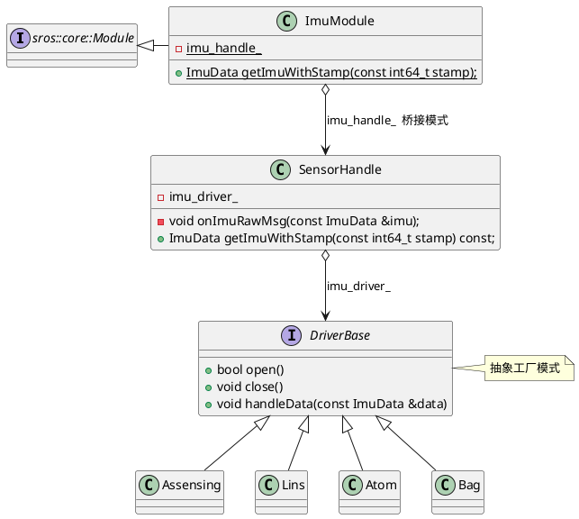

# imu模块类图

```puml
@startuml

interface  "sros::core::Module"
class ImuModule
{
    + {static} ImuData getImuWithStamp(const int64_t stamp);
    - {static} imu_handle_
}

class SensorHandle
{
    - void onImuRawMsg(const ImuData &imu);
    + ImuData getImuWithStamp(const int64_t stamp) const;
    - imu_driver_
}
interface DriverBase
{
    + bool open()
    + void close()
    + void handleData(const ImuData &data)
}
class "Assensing"
class Lins

sros::core::Module <|- ImuModule 
ImuModule o--> SensorHandle:"imu_handle_  桥接模式"
SensorHandle o-->DriverBase:"imu_driver_"
DriverBase <|-- Assensing
DriverBase <|-- Lins
DriverBase <|-- Atom
DriverBase <|-- Bag
note right of DriverBase : 抽象工厂模式


@enduml
```
