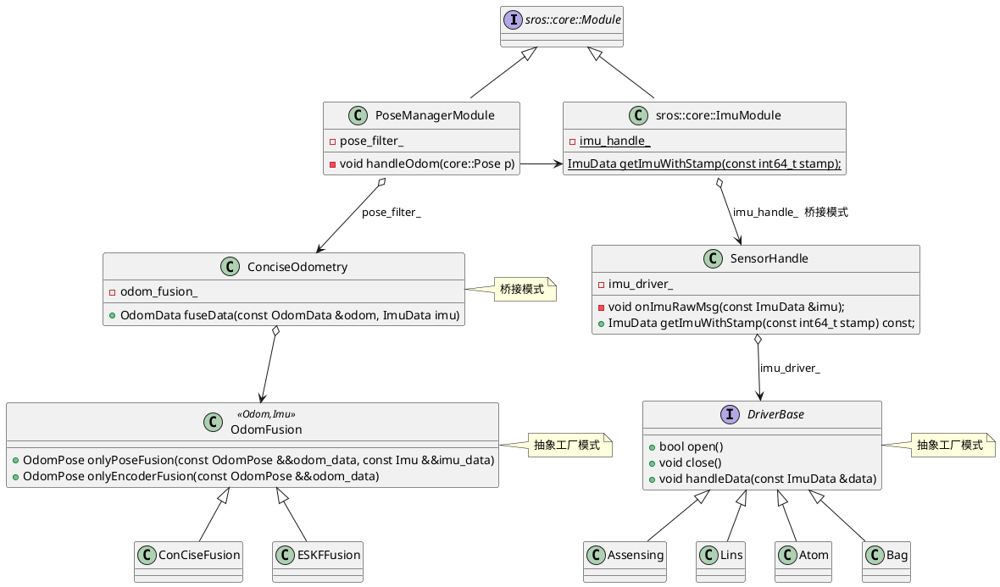

# posefilter模块类图

```puml
@startuml
interface sros::core::Module
class PoseManagerModule
{
    - void handleOdom(core::Pose p)
    - pose_filter_
}
class ConciseOdometry
{
    + OdomData fuseData(const OdomData &odom, ImuData imu)
    - odom_fusion_
}
class sros::core::ImuModule
{
    {static} ImuData getImuWithStamp(const int64_t stamp);
}
class OdomFusion <<Odom,Imu>>
{
    +OdomPose onlyPoseFusion(const OdomPose &&odom_data, const Imu &&imu_data)
    +OdomPose onlyEncoderFusion(const OdomPose &&odom_data)
}

sros::core::Module <|-- PoseManagerModule
PoseManagerModule o--> ConciseOdometry:pose_filter_
PoseManagerModule::handleOdom -> sros::core::ImuModule::getImuWithStamp
note right of ConciseOdometry:桥接模式
ConciseOdometry o--> OdomFusion
note right of OdomFusion:抽象工厂模式
OdomFusion <|-- ConCiseFusion
OdomFusion <|-- ESKFFusion


class sros::core::ImuModule
{
    -{static} imu_handle_
}

class SensorHandle
{
    - void onImuRawMsg(const ImuData &imu);
    + ImuData getImuWithStamp(const int64_t stamp) const;
    - imu_driver_
}
interface DriverBase
{
    + bool open()
    + void close()
    + void handleData(const ImuData &data)
}
class "Assensing"
class Lins

sros::core::Module <|- sros::core::ImuModule 
sros::core::ImuModule o--> SensorHandle:"imu_handle_  桥接模式"
SensorHandle o-->DriverBase:"imu_driver_"
DriverBase <|-- Assensing
DriverBase <|-- Lins
DriverBase <|-- Atom
DriverBase <|-- Bag
note right of DriverBase : 抽象工厂模式


@enduml
```
