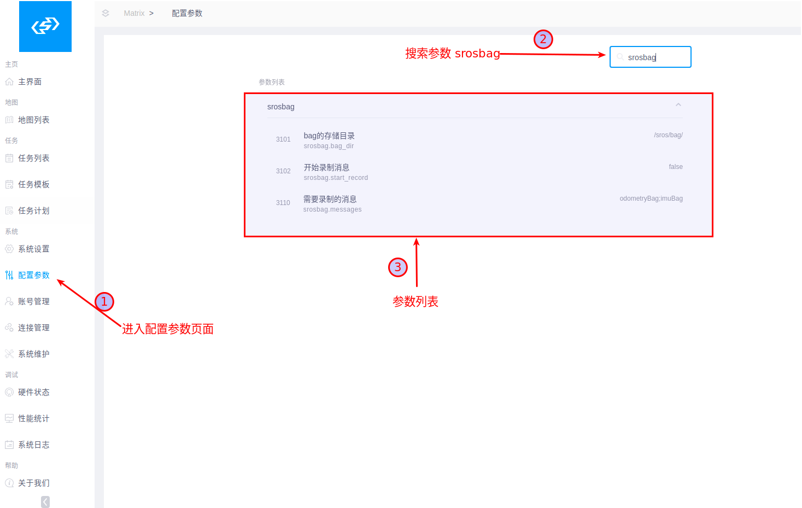
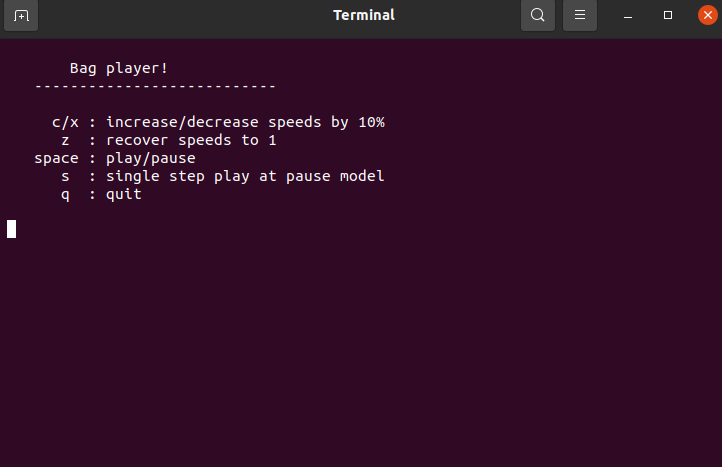

# 数据录制及回放程序 Bag

通用的数据存储及回放框架，可使用boost_serialization或protobuf进行数据序列化及反序列化操作

## 1.Message结构

```c++
struct Imu
{
    std_msgs::Header header;
    ...
    static std::string msgType() { return "imuBag"; } // 用于数据录制的类型标记
};
```

### 1.1 Message构造

message==必须==提供默认构造

### 1.2 序列化方法

在框架上可支持boost-serialization和protobuf两种形式的序列化方式。

#### 1.2.1 boost serialization

boost版本要求 <=1.68
boost serialization包含侵入式和非侵入式两种使用方法。具体使用方法参考[boost serialization使用教程](https://www.boost.org/doc/libs/1_76_0/libs/serialization/doc/index.html)

若采用非侵入式方法，将非侵入部分代码放入目录*serialize_patch*中，并将其在*headers.h*中进行include，如下所示：

```c++
#ifndef SERIALIZE_PATCH_HEADERS_H
#define SERIALIZE_PATCH_HEADERS_H

#include "serialize_imu.h"
#include "serialize_odometry.h"

#endif
```

#### 1.2.2 protobuf

在框架中已经添加protobuf类型的序列化及反序列化实现，如需使用protobuf类型的message需要对其进行类似1.1~1.3节的规定(需要根据需求进行讨论，定义规范)，格式确定后，对**getMsgType()** 和**getMsgTime()** 进行实现。

## 2.使用方法

### 2.1 message类型注册

#### 2.1.1 指明message类型

在*message_registration/message_container*中指明需要录制数据的类型，如下代码为添加两个需要录制的内容：

```c++
#include "products/imu_msg.hpp"
#include "products/odometry_msg.hpp"

HANDLE_TYPES(
    Imu,
    nav_msgs::Odometry )
```

操作步骤如下：

1. include相应类型的头文件;
2. 将类型添加到**HANDLE_TYPES**;

#### 2.1.2 类型注册

在**message_registration.cpp**文件中使用宏**EXPORT_MSG**对类型进行注册，如下所示：

```c++
#include "factory/export_macro.hpp"

EXPORT_MSG(Imu::msgType(), Imu)
EXPORT_MSG("ImuBag",Imu,false)
```

宏**EXPORT_MSG**的第一个参数为string类型的topic名称(可自定义)，第二个参数为要注册的MsgClass，第三个参数为是否进行数据压缩(默认为true)。

由于数据压缩时会包含一些额外的编码信息，所以过小的数据类型经过压缩后，占用空间反而会增大。过大的数据进行压缩时也会增加耗时问题。需要根据实际使用情况选择是否进行压缩数据。

### 2.2 非SROS数据录制

#### 2.2.1. 获得bag实例,参数为bag的目录

```c++
    auto bag = MsgBag::Create("/home/zmy/message_bag/");
```

#### 2.2.2 配置需要录制的类型名称

```c++
    std::vector<std::string> names;
    names.emplace_back("imuBag");
    names.emplace_back("odometryBag");
    bag->startRecord(names);
```

构建vector容器，包含需要录制的类型名
==注意：== 这里的topic必须与函数**EXPORT_MSG** 中的设置一致。

#### 2.2.3 录制数据

在需要录制数据的地方添加如下代码：

```c++
 bag->dumpMsg<Imu>(imu,"imuBag");                 (1)
```

需要对应的topic(注册时指定的)，如(1)所示。

### 2.3 SROS环境数据录制

#### 2.3.1 sros消息订阅与发送

sros中模块与模块之间是通过消息通信的，用户可以定制自己的消息。

##### 2.3.1.1 消息定义

所有消息都继承消息基类BaseMsg，消息都需要放到./sros-core/core/msg/目录下，下面为一个canbus数据消息定义，./sros-core/core/msg/path_msg.hpp内容如下：

```c++
#ifndef SROS_PATH_MSG_HPP_
#define SROS_PATH_MSG_HPP_

#include "base_msg.h"

#include <memory>

#include "core/navigation_path.h"

namespace sros {
namespace core {

class PathMsg : public BaseMsg {
public:
    PathMsg() : BaseMsg("PathMsg", TYPE_PATH_DATA){}
    PathMsg(const topic_t &topic) : BaseMsg(topic, TYPE_PATH_DATA) {
        paths.clear();
    }

    virtual ~PathMsg() { }

    virtual void getTime() { };

    NavigationPath_vector paths;

};

typedef std::shared_ptr <PathMsg> PathMsg_ptr;

} /* core */
} /* sros */

#endif //SROS_PATH_MSG_HPP_
```

有一种是实时消息，即当消息队列中存在已经存在一个相同消息时，需要将老的消息删掉，保证只保留最新的消息。这时候需要将is_real_time_设置为true。

##### 2.3.1.2 消息发送

当要发送消息时，先构造消息体，然后初始消息内容，最后调用Module::sendMsg()或static MsgBus::sendMsg()函数发送消息。

```c++
auto path_msg = make_shared<PathMsg>("NAV_PATH");
path_msg->paths = cur_paths_;
sendMsg(path_msg)
```

##### 2.3.1.3 消息订阅

当某个模块需要订阅消息时，可以在run()函数中订阅对应的消息，当收到消息后，将消息从基类转换成目标消息。

```c++
void MainModule::run() {
    LOG(INFO) << "MainModule 正在初始化...";

    ...
    subscribeTopic("NAV_PATH", CALLBACK(&MainModule::onPathMsg));
 ...
        
}

void MainModule::onPathMsg(const core::base_msg_ptr &m) {
    auto msg = dynamic_pointer_cast<PathMsg>(m);
    LOG(INFO) << "收到navigation生成的路径 :" << msg->paths.size();
    
    ...
 }
```

#### 2.3.2 srosbag module使用

sros中已经嵌入了srosbag模块，由*modules/srosbag/sros_bag_module.cpp* 中 *void subscribeSensorMsg()* 、*void subscribeLargeSensorMsg()* 的两个函数负责数据订阅录制，如下所示：

```c++
void BagModule::subscribeSensorMsg()
    {

        subscribeTopic("TOPIC_LASER", CALLBACK(&BagModule::msgCallback<sros::core::LaserScanMsg>));
        subscribeTopic("FIRST_SCAN", CALLBACK(&BagModule::msgCallback<sros::core::LaserScanMsg>));
        subscribeTopic("SECOND_SCAN", CALLBACK(&BagModule::msgCallback<sros::core::LaserScanMsg>));
    }

    void BagModule::subscribeLargeSensorMsg()
    {
        subscribeTopic("TOPIC_D435_COLOR", CALLBACK(&BagModule::largeMsgCallback<sros::core::ImageMsg>));

        subscribeTopic("TOPIC_D435_DEPTH", CALLBACK(&BagModule::largeMsgCallback<sros::core::ImageMsg>));

        subscribeTopic("TOPIC_COLOR", CALLBACK(&BagModule::largeMsgCallback<sros::core::ImageMsg>));
    }
```

这两个函数通过订阅sros话题的方式接受待录制的数据并将其记录到sbag中，==记录数据使用的topic为msg的成员变量topic_的数据==，如sros::core::LaserScanMsg中的topic_："TOPIC_LASER"。

*void subscribeSensorMsg()*负责接收==低频小数据量==的msg，如laser_scan  
*void subscribeLargeSensorMsg()*负责接收==高频大数据量==的msg，如image

#### 2.3.3 在Matrix中录制数据

##### 2.3.3.1 在Matrix中录制数据操作步骤

1. 进入参数设置页面
2. 搜索参数 ‘srosbag’
3. 配置参数



##### 2.3.3.2 参数使用

1. 使用默认存储路径
2. 设置需要**录制的消息**，多种消息以‘;’分隔，消息名必须与**注册时**的设置一致
3. 将**开始录制消息**设置为**true** 保存,开始录制
4. 结束录制时，将**开始录制消息**设置为**false** 结束录制，文件保存在1中设置的存储路径中

### 2.4 数据回放

#### 2.4.1. 获得bag实例,参数为bag的目录

```c++
    auto bag = MsgBag::Create("/home/zmy/message_bag/");
```

#### 2.4.2 设置message的处理函数

```c++
bag->setMsgHandle<Imu>([](const Imu &imu)
     { std::cout << "imu stamp:" << imu.header.stamp << std::endl; },
      "imuBag");
   
```

使用**setMsgHandle**函数通过指定message类型，传入**void(const Msg&)** 的函数和注册时对应的topic，对该类型进行处理。
==处理函数设置需在playback函数前==

#### 2.4.3 数据回放

```c++
bag->playBack("2021-05-26-16-23-26.bag");
bag->playBack("2021-05-26-16-23-26.bag", true);
bag->playBack("2021-05-26-16-23-26.bag", true,false);
bag->playBack("2021-05-26-16-23-26.bag", true,false, false);
```

通过传入bag文件进行数据回放，若bag在2.3.1所设置的目录中，则直接传递bag名称即可，否则需要传递绝对路径。
若需要控制终端进行play操作，可将playBack第二个参数置true，具体操作见2.4.4
若要以阻塞方式进行回放，可将playBack第三个参数置true，函数会阻塞到bag退出。
若要计算机处理速度回放，可将playBack第四个参数置false，将不会做message间的休眠。

#### 2.4.4 设置play操作

提供了变速，暂停,单步播放，停止等接口，当运行播放程序时会弹出如下窗口，可通过键盘进行相应操作



提供了如下源码接口，也可自定义使用

```c++
    void startRecord(const std::vector<std::string> &record_msgs);
    void printAllMsgType();
    void setSpeed(const float speed);
    void setSwitchTime(const uint64_t time);
    void setPause();
    void nextStep();
    void stopPlay();
```

## 3.bag格式解析

bag文件的格式如下：

```bag
1631858574973723;imuBag,1;my_imu,1;odometryBag,1;
1631858574973723:imuBag
x^A«g^Td``=Æ%TWÊÁàñþ×ÿ´^[­,^L^L^Mö@<82>Á^AH8<80><88>^F8±^@Ä:<80>Îe^@^@Z¡^O^NENDMESSAGE
1631858574984723:my_imu
x^A«g^Td``å¿ïZWÊöÂ*144<94><85><81>¡Á^^H08^@     ^G^PÑ^@'^V<80>X^Gй^L^@á¤^LìENDMESSAGE
1631858575005034:odometryBag
x^A«g^Td``ýËæVWÊÈÆÀÂÀàà^@$^Z@Ä^B^P^Aæ>^@±^N <8a>5 r¡²^L^@^[7^M.ENDMESSAGE
1631858575005185:imuBag
x^A«g^Td``}®çVWÊÁàñþ×ÿ´^[­,^L^L^Mö@<82>Á^AH8<80><88>^F8±^@Ä:<80>Îe^@^@xÎ^O<87>ENDMESSAGE
1631858575015366:my_imu
x^A«g^Td``Ý^ZæVWÊöÂ*144<94><85><81>¡Á^^H08^@    ^G^PÑ^@'^V<80>X^Gй^L^@é<8d>^M
ENDMESSAGE
1631858575035684:odometryBag
x^A«g^Td``]^çVWÊÈÆÀÂÀàà^@$^Z@Ä^B^P^Aæ>^@±^N <8a>5 r¡²^L^@$<93>^MPENDMESSAGE
```

bag文件的第一行记录了录制的信息，使用 **;** 分隔。

1. **1622017406945217**为bag的录制时间;

2. **imuBag,1;odometryBag,1;** 为所录制的数据类型，数据类型后面的1或0用来表示该数据是否经过压缩。  

3. 第一行之后为具体数据。使用"ENDMESSAGE"作为数据的头和结尾标志。如下所示

```bag
1631858574973723:imuBag
x^A«g^Td``=Æ%TWÊÁàñþ×ÿ´^[­,^L^L^Mö@<82>Á^AH8<80><88>^F8±^@Ä:<80>Îe^@^@Z¡^O^NENDMESSAGE
```
